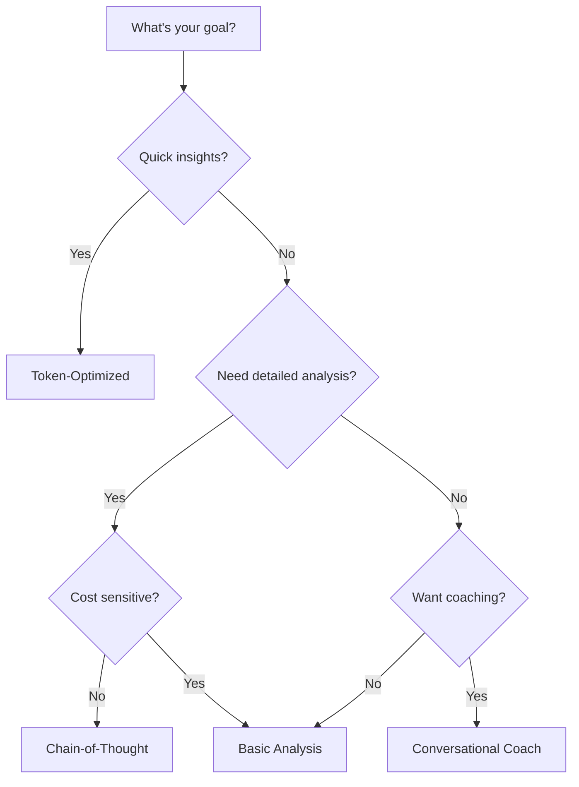

# Prompt Selection Guide

## Quick Decision Tree



## Template Comparison Matrix

| Feature | Basic | Chain-of-Thought | Token-Optimized | Conversational |
|---------|-------|------------------|-----------------|----------------|
| **Cost** | $0.13 | $0.26 | $0.08 | $0.15 |
| **Speed** | Fast | Slow | Very Fast | Fast |
| **Detail Level** | Medium | Very High | Low | Medium |
| **Insights Depth** | Good | Excellent | Basic | Good |
| **Personalization** | Low | Low | None | Very High |
| **Best For** | General analysis | Research | Screening | Coaching |

## Use Case Recommendations

### 📊 Basic Analysis Template
**When to use:**
- First-time analysis of a wallet
- Generating reports for clients
- Quick performance overview
- Balanced cost vs detail

**Example scenario:** "I need a comprehensive but readable analysis for my monthly trading review."

### 🧠 Chain-of-Thought Template
**When to use:**
- Deep behavioral pattern analysis
- Understanding complex trading mistakes
- Educational content creation
- Research and case studies

**Example scenario:** "I want to understand WHY I keep losing money and see the exact thought process."

### ⚡ Token-Optimized Template
**When to use:**
- Analyzing hundreds of wallets
- Real-time monitoring dashboards
- Quick pre-screening before deeper analysis
- Highly cost-sensitive applications

**Example scenario:** "I need to scan 1,000 wallets to find the top performers without breaking the bank."

### 💬 Conversational Coach Template
**When to use:**
- Personal trading improvement
- Building user engagement
- Creating content for trading education
- Providing emotional support with analysis

**Example scenario:** "I need honest but encouraging feedback on my trading to stay motivated."

## Combining Templates Strategy

For comprehensive analysis, use templates in sequence:

1. **Start with Token-Optimized** for quick screening
2. **Use Basic Analysis** for promising candidates
3. **Apply Chain-of-Thought** for deep dives
4. **Finish with Conversational Coach** for actionable advice

### Example Workflow
```javascript
// Step 1: Quick screen
const quickAnalysis = await analyzeWithTemplate(trades, 'token-optimized');

if (quickAnalysis.needsDeeperLook) {
  // Step 2: Detailed analysis
  const detailed = await analyzeWithTemplate(trades, 'chain-of-thought');
  
  // Step 3: Personalized coaching
  const coaching = await analyzeWithTemplate(trades, 'conversational');
}
```

## Cost Optimization Tips

1. **Batch Processing**: Group similar wallets and use token-optimized template
2. **Caching**: Store analysis results to avoid re-processing
3. **Progressive Enhancement**: Start cheap, go deeper only when needed
4. **Data Reduction**: Send only essential fields for initial analysis

## Performance Considerations

- **Response Time**: Token-optimized < Basic < Conversational < Chain-of-Thought
- **Token Limits**: Ensure your wallet data + prompt fits within model limits
- **Rate Limiting**: Space out requests when processing many wallets
- **Model Selection**: Use GPT-3.5 for token-optimized, GPT-4 for complex analysis

## Integration with WalletDoctor Client

```javascript
import { WalletDoctorClient } from '@walletdoctor/client-ts';
import { templates } from './prompt-templates';

async function analyzeWallet(wallet: string, templateType: string) {
  const client = new WalletDoctorClient({ apiKey: 'wd_key' });
  const trades = await client.exportTrades(wallet);
  
  const template = templates[templateType];
  const prompt = template.replace('{{WALLET_DATA}}', JSON.stringify(trades));
  
  // Send to your preferred LLM
  return await llm.complete(prompt);
}
``` 